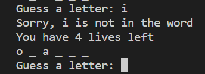

# Hangman
Hangman is a classic game in which a player thinks of a word and the other player tries to guess that word within a certain amount of attempts (represented by lives).
This is an implementation of the Hangman game written in Python.

## Project Layout
The project is comprised of:
- Template file: to allow users to implement their own hangman game.
- milestone 2-4 files: as the file number increases consecutively, each subsequent file contains a greater number of coding implementation.
- milestone 5: the final and complete implementation of the hangman game  

## Requirements
- `Python 3.9x`

## Instructions
The game will prompt you to guess a letter within a word, checking if it is within the word or not.
- If your guess is correct, the word will reveal where your letter applies. The game will prompt you to guess again.

- If your guess is incorrect, the game will notify you and take away a life.

- The game ends when the user has successfully guessed all the letters within the word or the number of lives are depleted.

